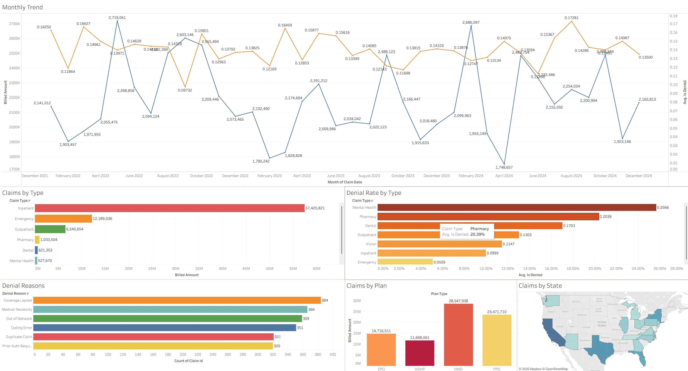

# Meridian Health Insurance — Claims Analysis

## Project Overview

Claims cost and denial pattern analysis for **Meridian Health Insurance**, a mid-size regional insurer processing ~15,000 claims annually. Over 2022–2024, operational costs rose 23%. This project identifies the highest-cost claim types, denial rate drivers, and monthly cost trends to support cost containment decisions.

**Data scope:** 15,000 claims | Jan 2022 – Dec 2024 | $78.4M total billed | $41.5M paid

## Live Dashboard

[**→ View on Tableau Public**](https://public.tableau.com/app/profile/nurbol.sultanov/viz/MeridianHealthInsuranceClaimsAnalysis/MeridianInsuranceClaims)

## Dashboard Preview

## Key Findings

- **Overall denial rate: 14.0%** — Mental Health claims denied at highest rate (22%+)
- **Inpatient claims** drive the most cost despite lower volume — avg $18K per claim
- **HDHP & HMO plans** show 35% higher denial rates than PPO
- **Coverage Lapsed & Medical Necessity** are top denial reasons — combined 35% of all denials
- **Pharmacy denials** at 18% — highest among routine claim types
- Monthly billed costs show consistent upward trend through 2023–2024

## Stack

- **Python** (pandas, NumPy)
- **SQL** (SQLite)
- **Tableau Public** ([Live Dashboard →](https://public.tableau.com/app/profile/nurbol.sultanov/viz/MeridianHealthInsuranceClaimsAnalysis/MeridianInsuranceClaims))

## Repository Structure

├── data/
│   ├── raw/              # claims.csv
│   ├── processed/        # 9 aggregated CSVs for Tableau
│   └── sql/              # analysis queries
├── notebooks/
│   └── analysis.py       # full analysis pipeline
├── src/
│   └── generate_data.py
└── dashboard/
└── screenshots/

## Author

Nurbol Sultanov — Data Analyst  
[LinkedIn](https://www.linkedin.com/in/nurbolsultanov/) · [GitHub](https://github.com/nurbolsultanov)